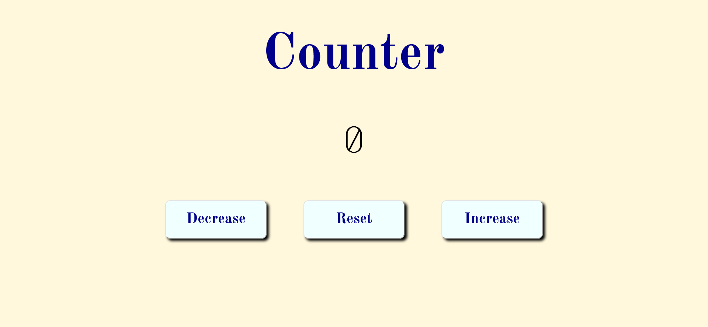

# Counter page

The page was created as part of the [Front End Developer Course by Orange DC](https://digitalcenter.orange.md/).

## Table of contents

- [Counter page](#counter-page)
  - [Table of contents](#table-of-contents)
  - [Screenshot](#screenshot)
  - [Links](#links)
  - [Tasks](#tasks)
  - [Counter Code Description](#counter-code-description)
  - [Author](#author)

## Screenshot

## Links

[Counter Page](https://axinitm.github.io/ODC-Counter-page/)

## Tasks

Create a Counter page.

## Counter Code Description

The code creates a counter application. Users can increase, decrease, or reset the number displayed on the screen. 
The page is optimized for mobile devices (screen sizes of 470 px and smaller). 
CSS variables are used for convenience, while interactivity is provided through JavaScript and event handlers.

## Author

[Andrei Martinenko](https://github.com/AxinitM)
